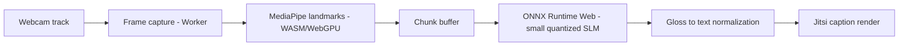

# मिलन (Milan) — Technical Specification
### Sign Language Live Captioning · SIH 2026
**Document type:** Internal technical spec + build tracker. This is the working document — update it as tasks move. It is meant to be the single thing you paste into a new Claude session to get instant context on where the build stands.

**Guiding principle for every decision in this document:** the best tech here is the tech that disappears. A small model that quietly works beats a bigger one that impresses on paper. Every choice below is filtered through "does this make the extension simpler, lighter, and more likely to just work" — not "is this the more sophisticated approach."

---

## 0. Current Status (update this every session)

> **Next task to pick up:** _T-A1 and T-B1 (both unblocked, start here)_
> **Last updated:** _fill in when you edit this_
> **Blocked on:** _none yet_

This block is the first thing to read and the first thing to update. A future session (human or Claude) should be able to read only this section and `TASKS.md` in the repo and know exactly what to do next.

---

## 1. Development Plan — Task Index, Not a Timeline

Work is tracked as an ordered, dependency-linked list of tasks, not weeks. Pick the next unblocked task, do it, mark it done, move on. Two tracks run in parallel; they only synchronize at one real handoff point (T-A10 → T-B7).

**Status legend:** `[ ]` not started · `[~]` in progress · `[x]` done · `[!]` blocked

This exact list should also live in the repo as `TASKS.md` — this document and that file must always agree. When you finish a task, check it off in both places.

### Track A — Model

| ID | Task | Depends on | Definition of done |
|---|---|---|---|
| `[ ]` **T-A1** | Lock the landmark schema (keypoint set, frame rate, normalization convention) and commit `landmark_schema.md` | — | Track B can build against this without asking Track A anything else |
| `[ ]` **T-A2** | Get DGX-H200 access working: SSH/JupyterHub login confirmed, one shared environment definition committed, GPU visibility verified with a trivial script | — | `nvidia-smi` and a one-line `torch.cuda.is_available()` check both succeed from a `tmux` session |
| `[ ]` **T-A3** | Write offline landmark-extraction script (MediaPipe, Python) and run it over INCLUDE | T-A1 | INCLUDE fully converted to landmark tensors, cached on shared DGX storage |
| `[ ]` **T-A4** | Pretrain the landmark encoder on INCLUDE (isolated-sign classification) | T-A2, T-A3 | A checkpoint exists that reasonably classifies INCLUDE's isolated signs |
| `[ ]` **T-A5** | Pull iSign, verify it's genuinely sentence/continuous-level (not isolated), spot-check signer count and any dialect metadata | T-A2 | A short written note in-repo confirming what iSign actually contains, so nothing downstream is built on an assumption |
| `[ ]` **T-A6** | Build the smallest possible streaming SLM (chunked/causal attention, not full bidirectional) and validate it on a small iSign subset | T-A4, T-A5 | It produces *any* coherent partial captions on a handful of held-out clips — correctness of the mechanism, not accuracy yet |
| `[ ]` **T-A7** | Full fine-tune of the validated SLM on iSign, starting from the INCLUDE-pretrained encoder | T-A6 | A checkpoint with a real, recorded accuracy/quality number on held-out iSign data |
| `[ ]` **T-A8** | Gloss → text normalization — start rule-based (topic-comment reorder, copula insertion); only upgrade to a learned model if time remains | T-A1 (can start early, doesn't block on T-A7) | Given a gloss sequence, produces a grammatically plausible sentence |
| `[ ]` **T-A9** | Distill + int8-quantize the fine-tuned SLM down to a browser-runnable size (tens of millions of params) | T-A7 | Quantized checkpoint exists and its accuracy drop vs. T-A7 is measured and acceptable |
| `[ ]` **T-A10** | Export to ONNX and push the artifact to the shared location the extension reads from | T-A9 | `.onnx` file loads successfully in a plain ONNX Runtime Web smoke test, outside the extension |
| `[ ]` **T-A11** | Build the isolated-vs-continuous comparison (INCLUDE baseline next to iSign result) for the judge-facing slide | T-A4, T-A7 | One clear chart/table, ready to drop into the pitch |
| `[ ]` **T-A12** | Confirm final exported model's disk size and rough in-memory footprint | T-A10 | A number you can say out loud in Q&A |

### Track B — Extension

| ID | Task | Depends on | Definition of done |
|---|---|---|---|
| `[ ]` **T-B1** | Scaffold the Chromium extension (Manifest V3, permissions, minimal content script that confirms it loads on a Jitsi page) | — | Extension installs unpacked and logs something on a real Jitsi call |
| `[ ]` **T-B2** | Frame capture via Insertable Streams (`MediaStreamTrackProcessor`) inside a Web Worker | T-B1 | Worker receives raw video frames from the local track, confirmed by logging frame count |
| `[ ]` **T-B3** | Wire in MediaPipe Tasks Vision landmark extraction in-browser (WASM path first) | T-B2, T-A1 | Landmarks extracted in-browser match the locked schema exactly |
| `[ ]` **T-B4** | Build the sliding-window chunk buffer | T-B3 | Buffer emits fixed-size, overlapping chunks at a steady rate |
| `[ ]` **T-B5** | Stub inference module returning a dummy/rotating caption string | T-B4 | Rendering work can proceed without waiting on Track A |
| `[ ]` **T-B6** | Caption renderer targeting Jitsi's native caption surface where possible, DOM overlay as fallback within Jitsi itself | T-B5 | A caption visibly appears on-screen during a real Jitsi call, sourced from the stub |
| `[ ]` **T-B7** | Swap the stub for real ONNX Runtime Web inference using the exported model | T-A10, T-B5 | Real captions appear, sourced from the actual model, end to end |
| `[ ]` **T-B8** | Add WebGPU execution path, with the WASM path from T-B3/T-B7 kept and explicitly tested as the fallback | T-B7 | Confirmed working with WebGPU disabled (e.g. via flag) as well as enabled |
| `[ ]` **T-B9** | Wire gloss-normalization output (T-A8) into the render pipeline instead of raw gloss | T-A8, T-B7 | Captions read as sentences, not gloss fragments |
| `[ ]` **T-B10** | Measure and tune end-to-end latency (capture → caption on screen); adjust chunk window/frame downsampling against the real numbers | T-B7, T-B8 | A logged, reproducible latency number, with the chunk window tuned against it |
| `[ ]` **T-B11** | Measure RAM/CPU footprint on a plain laptop with no discrete GPU | T-B8 | A number you can say out loud in Q&A, plus confirmation it doesn't visibly slow the browser tab |
| `[ ]` **T-B12** | UX polish pass on caption rendering (placement, readability, interim vs. final caption styling) | T-B10 | Someone unfamiliar with the project can watch a recorded demo and read the captions comfortably |

**The one real sync point:** everything in Track B up through T-B6 runs entirely off the stub (T-B5) and needs nothing from Track A. Track A should treat T-A10 (export) as its highest-priority deliverable — it's the single artifact that unblocks the other track's second half.

---

## 2. Repository Structure (detailed — this is the part to get right)

**Monorepo.** The two tracks share exactly one contract (the landmark schema + the ONNX export), and a single `TASKS.md` should be visible to both — a monorepo keeps that contract impossible to silently drift.

```
milan/
├── README.md                       # what this is, how to get a checkout running, points to TASKS.md
├── TASKS.md                        # THE mirror of the task table in §1 — always kept in sync with this doc
├── environment.yml                 # one shared conda/pip environment definition for DGX + local model work
├── .gitignore
├── LICENSE
│
├── docs/
│   ├── idea-doc.md                 # the narrowed, judge/context-facing problem document
│   └── technical-spec.md           # this document, kept in the repo so it travels with the code
│
├── model/                          # Track A — everything that runs on the DGX
│   ├── data/
│   │   ├── landmark_schema.md      # T-A1's output — the locked contract, read this before touching anything else
│   │   ├── download_include.sh
│   │   └── download_isign.sh
│   ├── preprocessing/
│   │   └── extract_landmarks.py    # T-A3 — offline MediaPipe extraction, run once, cache output
│   ├── encoder/
│   │   └── pretrain_include.py     # T-A4
│   ├── slm/
│   │   ├── streaming_attention.py  # T-A6 — the chunked/causal attention model definition
│   │   └── finetune_isign.py       # T-A7
│   ├── gloss_normalization/
│   │   └── normalizer.py           # T-A8 — rule-based first, swap for learned later without changing the interface
│   ├── export/
│   │   ├── distill_quantize.py     # T-A9
│   │   └── to_onnx.py              # T-A10 — the file that produces the artifact Track B consumes
│   └── notebooks/                  # scratch/debugging only — nothing load-bearing lives only here
│
├── extension/                      # Track B — everything that ships to the browser
│   ├── manifest.json               # Manifest V3
│   ├── src/
│   │   ├── capture/                # T-B2 — insertable streams, runs in a Web Worker
│   │   ├── landmarks/              # T-B3 — MediaPipe Tasks Vision wrapper
│   │   ├── buffer/                 # T-B4 — sliding-window chunk buffer
│   │   ├── inference/              # T-B5 stub, then T-B7 real ONNX Runtime Web wrapper — same interface both times
│   │   ├── render/                 # T-B6, T-B9, T-B12 — caption rendering into Jitsi
│   │   └── jitsi/                  # Jitsi-specific DOM/API hooks, isolated here so nothing else needs to know about it
│   ├── models/                     # exported .onnx artifact lands here (see note below on how it gets here)
│   └── tests/
│
├── evaluation/
│   ├── benchmark_include_baseline.py   # T-A11
│   ├── benchmark_isign.py
│   └── latency_profile.py              # T-B10 — the harness that produces the number you quote
│
└── .github/
    ├── ISSUE_TEMPLATE/
    │   └── task.md                 # every issue references a task ID (e.g. "T-B7"), keeps GitHub and TASKS.md aligned
    └── workflows/
        └── ci.yml                  # lint + extension build check + any fast model unit tests — nothing that needs the DGX
```

**Practical conventions worth setting on day one:**
- **Branch naming mirrors task IDs**: `task/T-A4-encoder-pretrain`, `task/T-B7-real-inference`. Anyone can look at the branch list and know exactly what's in flight.
- **Every PR checks off its task ID** in `TASKS.md` as part of the same PR — the tracker never drifts from reality because updating it is part of "done," not a separate chore.
- **GitHub Projects board**, columns: `Backlog → Next Up → In Progress → Blocked → Done`, one card per task ID, so there's a visual version of the same table for anyone who prefers a board over a markdown table.
- **The `.onnx` artifact handoff** (T-A10 → `extension/models/`): don't commit large binaries directly if avoidable — use Git LFS, or push to a shared drive/bucket and commit only a pointer file. Either way, the path `extension/models/` is the fixed location Track B code reads from, so this is a one-line change regardless of where the artifact actually lives.

---

## 3. Systems Architecture — Optimized for "Just Works," Not "Impressive"

### 3.1 The one-sentence architecture

Webcam frames are intercepted locally, turned into pose/hand landmarks in-browser, fed in small overlapping chunks into a small quantized streaming model, and the resulting text is written onto the Jitsi caption surface — nothing here needs a server, a big model, or a complicated runtime.



### 3.2 Design constraints, stated as numbers (so "lightweight" is checkable, not just a vibe)

| Constraint | Target | Why this number |
|---|---|---|
| Exported model disk size | Tens of MB (int8), not hundreds | Anything bigger stops feeling "invisible" — it becomes a visible download/load delay |
| Extension RAM footprint (steady state) | As low as practically achievable; measured and reported (T-B11), not assumed | A background captioning tool that visibly slows the meeting tab has failed its own premise |
| End-to-end latency (capture → caption) | ≤ ~1.5–2s, with interim captions updating faster | Matches how live ASR captions already feel to a user, so this doesn't feel like a novel/slower interaction |
| Frame rate into the landmark extractor | Downsampled well below webcam default (validate empirically, likely 15fps range) | ISL doesn't need full frame rate for pose extraction — this is the single cheapest latency/CPU win available |

### 3.3 Why each piece is the simple version, not the fancy one

- **One small streaming model, not an ensemble.** A single chunked/causal-attention transformer, quantized, is enough to prove the concept and is dramatically easier to keep light and debuggable than a multi-model pipeline. Resist adding a second model unless T-A8's rule-based normalizer genuinely isn't good enough.
- **Rule-based gloss normalization by default.** A learned normalizer is a real upgrade but a second thing that can break, load, and add latency. Ship the rule-based version; only replace it if there's clearly time left after T-A7/T-B7 land.
- **WASM first, WebGPU as a bonus, not a requirement.** Building against the guaranteed-available path first means the demo never depends on the judge's or teammate's hardware happening to support WebGPU. WebGPU is purely an "if available, go faster" layer added after WASM already works (T-B8).
- **Two Web Workers (capture/landmarks, inference), not one, and not more than two.** Enough to keep the meeting tab responsive; more than that adds coordination complexity for no real benefit at this scale.
- **No Docker requirement for the extension side at all** — it's a browser extension; keep the build simple (plain bundler, no unnecessary tooling layers). Docker is optional even on the model side (§4) — only reach for it if the DGX environment turns out to need stricter reproducibility than a shared `environment.yml` gives you.

---

## 4. Tool Stack Reference

| Layer | Choice | Note |
|---|---|---|
| Source control / tracking | GitHub, monorepo, `TASKS.md` as source of truth | See §2 |
| Training compute | NVIDIA DGX-H200 (BMU AI Lab) | Single-GPU + mixed precision (bf16/amp) is enough for every task in §1 as scoped — don't reach for multi-GPU/DDP unless a specific run is genuinely too slow single-GPU |
| Quick local sandboxing | Optional — a local Python environment or a free-tier Colab notebook for debugging tiny code snippets before they touch the DGX | Not a dependency of anything in the task list; use only if it's genuinely faster than testing locally. No paid tier needed or expected — if it's not saving time, skip it entirely |
| Session management (DGX) | `tmux`/`screen` | Long jobs must survive an SSH drop |
| Env reproducibility | One shared `environment.yml` | Add a Dockerfile only if plain env files prove insufficient |
| Offline landmark extraction (training data) | MediaPipe (Python) | T-A3 |
| In-browser landmark extraction | MediaPipe Tasks Vision (Web, WASM baseline / WebGPU bonus) | T-B3 |
| Sequence model | Small streaming-attention transformer (chunked/causal) | Deliberately the simplest version of the streaming-safe idea, not an architecture search |
| Export format | ONNX | T-A10 |
| In-browser inference runtime | ONNX Runtime Web | T-B7, T-B8 |
| Extension platform | Chromium extension, Manifest V3 | T-B1 |
| Frame interception | Insertable Streams (`MediaStreamTrackProcessor`) | T-B2 |
| Concurrency | Web Workers (max two: capture/landmarks, inference) | §3.3 |
| Meeting platform | **Jitsi only** — see §5 | Deliberate scope cut |
| Training datasets | INCLUDE (pretrain + baseline), iSign (primary fine-tune) | T-A3–T-A7 |

---

## 5. Platform Integration: Jitsi Only

**Decision: build for Jitsi, and only Jitsi, for the hackathon build.** Google Meet and Zoom Web are dropped from scope entirely, not deferred as a "secondary" target — every extra platform is extra surface area that can break for reasons outside your control, and the team's effort is worth more spent making one integration genuinely solid than spread across three fragile ones.

**Why this is the right cut, not a compromise:**
- Jitsi is open-source — you can read its actual client code and caption pipeline instead of guessing at a closed platform's DOM. This is the only one of the three where a *robust*, not-easily-broken integration is realistically achievable on a hackathon timeline.
- Meet and Zoom Web are closed products that change their UI without notice. A DOM-overlay integration against either is inherently the kind of thing that can silently break the night before a demo — exactly the risk worth designing out when every unit of team effort needs to count.
- One platform, done well, is a stronger technical story in Q&A than three platforms done fragilely. "We integrated directly with Jitsi's caption pipeline" is a concrete, verifiable claim; "works across Meet, Zoom, and Jitsi" invites exactly the scrutiny you don't want if two of the three are overlay hacks.
- If there's real time left after the full task list in §1 is done, adding a Meet or Zoom overlay is a reasonable stretch goal — but it should not be planned for, scoped for, or promised in the pitch.

**What to say in the submission:** state Jitsi support plainly and specifically, and name multi-platform support as future work (this is a legitimate, honest answer to "potential for future work," which is a named rubric criterion) rather than a current, hedged claim.
